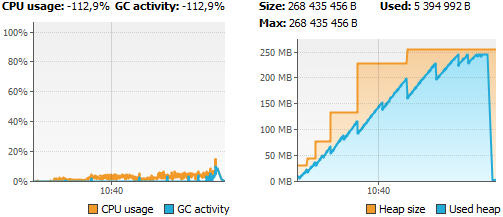
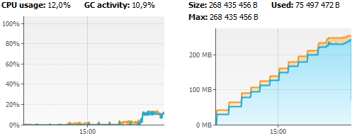
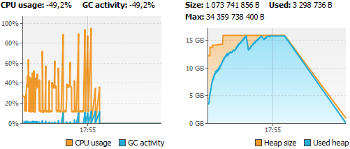

### Тест сборщиков мусора JVM

__Содержание__

+ [Постановка задачи](#s01)
+ [Описание способа тестирования и способа сбора информации](#s02)
+ [Предварительная настройка и выполнение тестирования](#s03)
+ [Сводные результаты тестирования](#s04)
    + [Результаты тестирования сборщиков мусора при объеме памяти 256 Mb](#s04-1)
    + [Результаты тестирования сборщиков мусора при объеме памяти 8 Gb](#s04-2)
    + [Результаты тестирования сборщиков мусора при объеме памяти 16 Gb](#s04-3)
+ [Выводы. Влияние сборщиков мусора](#s05)

---

#### Постановка задачи

На примере простого приложения понять какое влияние оказывают сборщики мусора.

Тестируем четыре сборщика мусора: SerialGC, ParallelGC, G1GC, ZGC.
Используем ПК с восьмипоточным процессором на трех объемах памяти: 256 Mb,
8 Gb, 16 Gb.

В результате выполнения работы мы должны собрать статистику (количество сборок,
время на сборки) по разным GC. А затем сделать выводы какой GC лучше и почему.

#### Описание способа тестирования и способа сбора информации

Алгоритм тестирования выполнен таким образом, чтобы исключение
OutOfMemoryException в любом случае было вызвано. Но при этом память должна
частично освобождаться для того, чтобы можно было наблюдать результат работы
сборщика мусора.

Создается список для хранения массивов объектов. Настройка теста осуществляется
параметром size. От него зависят стартовый размер списка и размер массивов.
В цикле этот список заполняется массивами, а затем удаляется примерно 1/4 от
добавленных элементов списка. При чем частично удаляются массивы созданные в
предыдущих циклах заполнения списка. Это позволяет в большей степени удалять
объекты, попавшие в Old Generation память.

Анализ работы сборщиков мусора производим с помощью лога, записанного в формате
CSV. В файл лога записываем параметры:
- App start time - время окончания STW и запуска основного потока приложения.
  Измеряем в миллисекундах от начала работы приложения. Расчетное значение.
- App duration - длительность работы основного потока приложения. Измеряем в
  миллисекундах.
  Расчетное значение.
- GC start time - время запуска сборщика мусора. Измеряем в миллисекундах
  от начала работы приложения. Значение получаем из объекта типа GcInfo.
- GC duration - длительность работы сборщика мусора. Измеряем в миллисекундах.
  Значение получаем из объекта типа GcInfo.
- usedMemory Before - использовано памяти до сборки мусора. В байтах.
- usedMemory After - использовано памяти после сборки мусора. В байтах.
- Released usedMemory  - освобождено памяти после сборки мусора. В байтах.
  Положительное значение означает, что память освобождена.
  Отрицательное - память использована.
- commitedMemory After  - на сколько расширена куча после сборки мусора.
  В байтах.
- gcCause - причина вызова сборщика мусора.
- gcName - наименование вызванного сборзика мусора.
- gcAction - действие, выполняемое сборщиком мусора.

#### Предварительная настройка и выполнение тестирования

Настройка длительности выполнения теста производится параметром `int size`
в методе `main(String[])` класса `Launch`.
Опишем три набора параметров. Строку в квадратных скобках [NameGC] необходимо
заменить на имя соответствующего сборщика: SerialGC, ParallelGC, G1GC, ZGC.

1. Максимальный объем доступной памяти - 256 Мb.  
   Параметры запуска JVM: -XX:+Use[NameGC] -Xms32m -Xmx256m  
   size = 50

   Для данного объема памяти необходимо включить метод `Thread.sleep(5)`
   класс `Bencmark`, метод `run()`.
   Он помечен комментарием `//Label_1: use for 256M test`.  

2. Максимальный объем доступной памяти - 8 Gb.  
   Параметры запуска JVM: -XX:+Use[NameGC] -Xms1g -Xmx8g  
   size = 1000

3. Максимальный объем доступной памяти - 16 Gb.  
   Параметры запуска JVM: -XX:+Use[NameGC] -Xms1g -Xmx16g  
   size = 2500

Тестирование начинается запуском метода `Launch.main()`. Подключаемся к
запущенному приложению утилитой VisualVM для оценки выполнения теста. После
завершения программы для анализа данных о сборках мусора нам доступен
лог-файл `%project_dir%\logs\hw04-GC\statlog_yyyyMMdd_HHmmss.csv`  

#### Сводные результаты тестирования

Строка 1. Количество выполненных итераций во время выполнения программы.

Эти данные выводятся в консоль. Этот параметр можно использовать для
сравнительного анализа в рамках тестирования для одного объема памяти.
В случае разных объемов сравнение будет некорректно. Потому что при изменении
параметра size, изменятся также размеры массивов, которыми оперирует
алгоритм тестирования.

Строка 4. Пропускная способность приложения.

Параметр показывает, какой процент от общего времени работы, приложение
выполняло основную вычислительную работу, а не сборку мусора.  

Вычисляется по следующей формуле:

P = 1 - T_GC / (T_GC + T_APP)

где  
P - пропускная способность приложения,  
T_GC - общее время работы GC,  
T_APP - время работы приложения без учета работы GC

__1. Результаты тестирования сборщиков мусора при объеме памяти 256 Mb.__

Начальный размер кучи: 32 Mb  
Максимальный размер кучи: 256 Mb  
Начальный размер массива (size): 50

|   |                                        | Serial GC   | Parallel GC | G1 GC       | ZGC         |
|---|:---                                    |:---:        |:---:        |:---:        |:---:        |
|1  |Количество выполненных итераций         |59293        |41283        |61154        |33782        |
|2  |Время работы приложения (без GC), мсек  |413418       |272699       |431367       |190761       |
|3  |Общее время работы GC, мсек             |9943         |4795         |2359         |27180        |
|4  |Пропускная способность                  |0,975        |0,98         |0,99         |0,87         |
|5  |Количество запусков GC                  |48           |197          |105          |99           |
|6  |Время GC Young Gen, мсек                |394          |1012         |715          | -           |
|7  |Количество запусков GC Young Gen        |13           |165          |91           | -           |
|8  |Среднее время работы GC Young Gen, мсек |30           |6            |8            | -           |
|9  |Время GC Old Gen, мсек                  |9549         |3783         |1644         |27180        |
|10 |Количество запусков GC Old Gen          |35           |32           |14           |99           |
|11 |Среднее время работы GC Old Gen, мсек   |273          |118          |117          |275          |

Расход ресурсов при тестировании SerialGC

Расход ресурсов при тестировании ParallelGC

Расход ресурсов при тестировании G1GC

Расход ресурсов при тестировании ZGC

__2. Результаты тестирования сборщиков мусора при объеме памяти 8 Gb.__

Начальный размер кучи: 1 Gb  
Максимальный размер кучи: 8 Gb  
Начальный размер массива (size): 1000

|   |                                        | Serial GC   | Parallel GC | G1 GC       | ZGC         |
|---|:---                                    |:---:        |:---:        |:---:        |:---:        |
|1  |Количество выполненных итераций         |3945         |3173         |4080         |2452         |
|2  |Время работы приложения (без GC), мсек  |200852       |113303       |246828       |53435        |
|3  |Общее время работы GC, мсек             |188496       |42470        |33068        |85802        |
|4  |Пропускная способность                  |0,52         |0,73         |0,88         |0,38         |
|5  |Количество запусков GC                  |36           |24           |54           |14           |
|6  |Время GC Young Gen, мсек                |6073         |2334         |4378         |-            |
|7  |Количество запусков GC Young Gen        |10           |9            |44           |-            |
|8  |Среднее время работы GC Young Gen, мсек |607          |259          |100          |-            |
|9  |Время GC Old Gen, мсек                  |182423       |40136        |28690        |85802        |
|10 |Количество запусков GC Old Gen          |26           |15           |10           |14           |
|11 |Среднее время работы GC Old Gen, мсек   |7016         |2676         |2869         |6129         |

Расход ресурсов при тестировании SerialGC

Расход ресурсов при тестировании ParallelGC

Расход ресурсов при тестировании G1GC

Расход ресурсов при тестировании ZGC

__3. Результаты тестирования сборщиков мусора при объеме памяти 16 Gb.__

Начальный размер кучи: 1 Gb  
Максимальный размер кучи: 16 Gb  
Начальный размер массива (size): 2500

|   |                                        | Serial GC   | Parallel GC | G1 GC       | ZGC         |
|---|:---                                    |:---:        |:---:        |:---:        |:---:        |
|1  |Количество выполненных итераций         |1266         |1034         |1309         |783          |
|2  |Время работы приложения (без GC), мсек  |159151       |89534        |175845       |2677         |
|3  |Общее время работы GC, мсек             |405686       |44707        |43424        |259517       |
|4  |Пропускная способность                  |0,28         |0,67         |0,8          |0,01         |
|5  |Количество запусков GC                  |41           |20           |57           |26           |
|6  |Время GC Young Gen, мсек                |12180        |5451         |7781         |-            |
|7  |Количество запусков GC Young Gen        |12           |11           |50           |-            |
|8  |Среднее время работы GC Young Gen, мсек |1015         |496          |156          |-            |
|9  |Время GC Old Gen, мсек                  |393506       |39256        |35643        |259517       |
|10 |Количество запусков GC Old Gen          |29           |9            |7            |26           |
|11 |Среднее время работы GC Old Gen, мсек   |13569        |4362         |5092         |9981         |

Расход ресурсов при тестировании SerialGC

Расход ресурсов при тестировании ParallelGC

Расход ресурсов при тестировании G1GC

Расход ресурсов при тестировании ZGC

#### Выводы. Влияние сборщиков мусора.

1. Оценка по пропускной способности.

   В самом начале работы планировалось использовать значения пропускной
   способности и средней задержки для оценки работы приложения с разными
   сборщиками мусора. Но в процессе работы выяснилось, что объект типа
   `GarbageCollectionNotificationInfo` не позволяет извлечь информацию о
   Stop The World времени, а только о времени различных фаз работы GC.
   Соответственно, выбранный метод подсчета справедлив для оценки SerialGC
   и ParallelGC в силу их неконкурентного устройства. В то же время, расчет
   параметров для G1GC и ZGC некорректен, т.к. нет возможности выделить
   информацию об STW из доступной информации по фазам.
   
   Из наших данных можем составить таблицу в порядке убывания пропускной
   способности:
   1 место - G1 GC  
   2 место - Parallel GC  
   3 место - Serial GC  
   4 место - ZGC
   
   По времени STW в порядке УВЕЛИЧЕНИЯ распределение выглядит так же. Но следует
   отметить, что расположение ZGC в этой таблице выглядит сомнительным.
   Он создавался с целью обеспечить минимально возможные остановки приложений.
   
2. Оценка по количеству выполненных итераций.
   
   Во всех тестах сборщики распределились в порядке убывания:  
   1 место - G1 GC  
   2 место - Serial GC  
   3 место - Parallel GC  
   4 место - ZGC
   
   Два последних сборщика более требовательны к памяти. 
   
3. Оценка работы теста при разных объемах памяти.
   
   Следует сказать, что условия, в которые мы ставим сборщики мусора в нашем
   тесте не являются штатными. И, как показывают результаты, в реальных условиях
   нельзя допускать работу приложений в условиях острой нехватки памяти. Даже
   если это не приводит к падению приложения, его производительность серьезно
   падает.
   
   Так, на графиках для 8 Gb и 16 Gb видна длинная горизонтальная площадка,
   которая в конце резко обрывается вниз. В большей или меньшей степени эффект
   проявляется в работе всех сборщиков. Это означает, что сборщики упорно
   пытаются освободить память в куче, запуская полные сборки и просматривая
   весь объем памяти в поисках объектов которые можно удалить. Этот процесс
   отнимает много ресурсов системы, при этом не производя полезных действий.
   
   Увеличение размера памяти, доступной приложению приводит к значительному
   увеличению времени сборок мусора. Это увеличивает и пропускную способность
   и потребление системных ресурсов. 
   

__Заключение для каждого сборщика.__

_SerialGC_

Может использоваться для небольших ненагруженных серверных систем, не
оборудованных многоядерными процессорами. И где не требуется высокая
отзывчивость системы.  
Сохраняется хороший отклик операционной системы на всем протяжении теста.
Даже в условиях острой нехватки памяти не подвешивает систему. Поэтому может
быть использован для десктопных приложений, если ПК поддерживает более двух
одновременных потоков.

_ParallelGC_

Во время запусков сборки сильно нагружает систему. Это происходит практически
сразу после запуска теста. В последней стадии, когда свободной памяти нет,
операционная система практически не отвечает. Если использовать в серверном
ПО, то не рекомендуется совмещать с другими сервисами на одном сервере.  
Так же обладает повышенными накладными расходами при работе с кучей. Это
приводит к снижению полезного объема памяти по сравнению с SerialGC и G1 GC.  
В десктопных приложениях лучше не использовать.

_G1GC_

Хороший отклик системы при штатной работе. Высокие задержки при работе
в условиях нехватки памяти. Превосходит остальные сборщики по всем параметрам,
кроме отклика операционной системы.  
Для серверных систем предпочтительно использовать G1GC.  
Возможно использовать в десктопных системах, но может потребоваться подстройка
параметров.

_ZGC_

Отклик системы очень хороший во всех режимах работы. Практически не заметна
работа сборщика на всем протяжении теста. Судя по количеству произведенных
итераций, достаточно высокие накладные расходы при работе с памятью.  
В серверном сценарии хорошо покажет себя там, где требуется высокий отклик
системы.  
Так же рекомендован к использованию для десктоп приложений.
